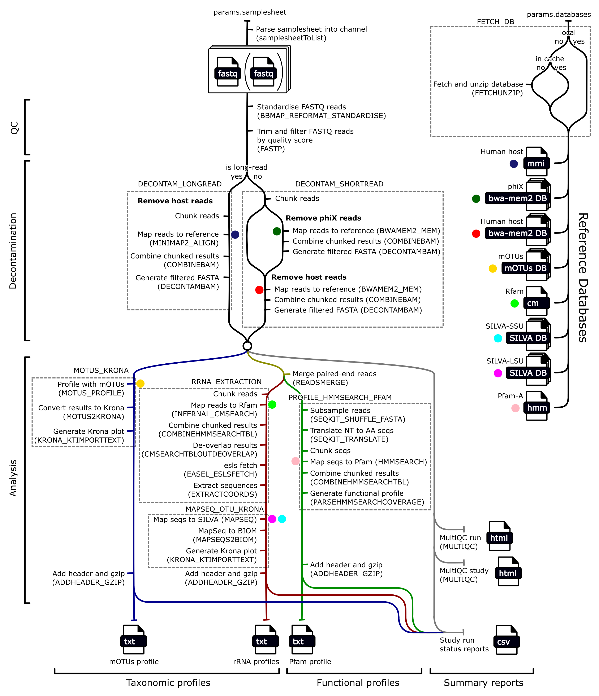

<h1>
  Raw Reads Analysis Pipeline (RawR)
  
</h1>
This pipeline analyses whole genome sequencing (WGS) reads, profiling their taxonomy and functions. It is designed to handle short (paired- and single-end) and long reads and to take raw reads (not assembled contigs or genomes) as input.

A previous pipeline analysing raw reads was a part of MGnify v5. This pipeline is a complete refactor and a significant update to be a part of MGnify v6. It is now implemented in Nextflow, and functional profiling has been added as well as a re-implementation of the existing taxonomic profiling method.

## Installation

Requires `Nextflow >= 0.24.1`

```bash
git clone https://github.com/EBI-Metagenomics/raw-reads-analysis-pipeline.git
```

## Usage

### Samplesheet

A samplesheet is essential for running the pipeline. All the information about the input runs that the pipeline needs is defined in this single `csv` file. The column names and values correspond to those found in ENA.

Samplesheet columns:
| Column                | Purpose                                                                                                                                 |
| --------------------- | --------------------------------------------------------------------------------------------------------------------------------------- |
| `study`               | Not used by pipeline, can be useful for user to keep track of samples                                                                   |
| `sample`              | Sample accession, used for naming the pipeline results. Must be unique.                                                                 |
| `fastq_1`             | Path to first FASTQ file (and only if the `library_strategy` is `SINGLE`). May be a filesystem path, `ftp` path or `s3` path.           |
| `fastq_2`             | Path to second FASTQ file (may be empty if the `library_strategy` is `SINGLE`).                                                         |
| `library_layout`      | `SINGLE` if single-end reads, or `PAIRED` if paired-end reads.                                                                          |
| `library_strategy`    | Not used                                                                                                                                |
| `instrument_platform` | The sequencing platform used to generate reads. This is used to determine long reads (`ONT` or `PB`) vs. short reads (everything else). |

Example:
```csv
study,sample,fastq_1,fastq_2,library_layout,library_strategy,instrument_platform
PRJEB12345,ERR00000001,/path/to/sample1/reads_1.fastq.gz,/path/read/sample1/reads_2.fastq.gz,PAIRED,WGS,ILLUMINA
PRJEB12345,ERR00000002,/path/to/sample2/reads_1.fastq.gz,/path/read/sample2/reads_2.fastq.gz,PAIRED,WGS,ILLUMINA
PRJEB12345,ERR00000003,/path/to/sample3/reads.fastq.gz,,SINGLE,WGS,ONT
```

### Important parameters

#### Basic

| Parameter            | Purpose                                                                          |
| -------------------- | -------------------------------------------------------------------------------- |
| samplesheet          | Path to samplesheet (required)                                                   |
| outdir               | Path to results directory (Deafult: `'./results'`)                               |
| skip_qc              | Skip Qaulity Control (QC) (Default: `false`)                                     |
| skip_decontam        | Skip Decontamination (Default: `false`)                                          |
| remove_phix          | Toggle remoiving phiX (Default: `true`)                                          |
| singularity_cachedir | Path to Singularity container cache directory (Default: `'./singularity_cache'`) |

#### Databases

| Parameter                                 | Purpose                                                                                |
| ----------------------------------------- | -------------------------------------------------------------------------------------- |
| databases.cache_path                      | Path to cache directory for database downloads (Deafult: `'download_cache/databases'`) |
| databases.motus.local_path                | Local (filesystem) path to mOTUs database (Default: `''`)                              |
| databases.motus.base_dir                  | Root directory of mOTUs database (Default: `'db_mOTU'`)                                |
| databases.host_genome.local_path          | Local (filesystem) path to host (hg38) `bwa-mem2` database (Default: `''`)             |
| databases.host_genome.base_dir            | Root directory of host `bwa-mem2` database (Default: `'hg38'`)                         |
| databases.host_genome_minimap2.local_path | Local (filesystem) path to host (hg38) `minimap2` database (Default: `''`)             |
| databases.host_genome_minimap2.base_dir   | Root directory of host `minimap2` database (Default: `'.'`)                            |
| databases.phix.local_path                 | Local (filesystem) path to phiX `bwa-mem2` database (Default: `''`)                    |
| databases.phix.base_dir                   | Root directory of phiX `bwa-mem2` database (Default: `'phix'`)                         |
| databases.rfam.local_path                 | Local (filesystem) path to Rfam database (Default: `''`)                               |
| databases.rfam.base_dir                   | Root directory of Rfam database (Default: `'rfam_models'`)                             |
| databases.silva_ssu.local_path            | Local (filesystem) path to SILVA-SSU database (Default: `''`)                          |
| databases.silva_ssu.base_dir              | Root directory of SILVA-SSU database (Default: `'silva_ssu-20200130'`)                 |
| databases.silva_lsu.local_path            | Local (filesystem) path to SILVA-LSU database (Default: `''`)                          |
| databases.silva_lsu.base_dir              | Root directory of SILVA-LSU database (Default: `'silva_lsu-20200130'`)                 |
| databases.pfam.local_path                 | Local (filesystem) path to Pfam-A database (Default: `''`)                             |
| databases.pfam.base_dir                   | Root directory of Pfam-A database (Default: `'.'`)                                     |
| force_download_dbs                        | Force downloading databases overwriting cache (Default: `false`                        |
| download_dbs                              | Enable downloading databases (Default: `true`)                                         |

#### Advanced

| Parameter                     | Purpose                                                                      |
| ----------------------------- | ---------------------------------------------------------------------------- |
| cmsearch_chunksize            | Size of reads chunks for `cmsearch` (Default: `400.KB`)                      |
| hmmsearch_chunksize           | Size of reads chunks for `hmmsearch` (Default: `400.KB`)                     |
| decontam_short_phix_chunksize | Size of reads chunks for short-read phiX decontamination (Default: `'400K'`) |
| decontam_short_host_chunksize | Size of reads chunks for short-read host decontamination (Default: `'400K'`) |
| decontam_long_host_chunksize  | Size of reads chunks for long-read host decontamination (Default: `'400K'`)  |
| save_trimmed_fail             | Save reads that fail QC trimming (Default: `false`)                          |

### Commands

Basic run:
```bash
nextflow run /path/to/pipeline --samplesheet /path/to/samplesheet.csv -profile local
```

Customised run:
```bash
nextflow run /path/to/pipeline --samplesheet /path/to/samplesheet.csv -profile local --databases.rfam.local_path='/path/to/db' --skip_qc
```

Custom profile with custom config:
```bash
nextflow run /path/to/pipeline --samplesheet /path/to/samplesheet.csv -c /path/to/custom.config -profile custom
```

Resume:
```bash
nextflow run /path/to/pipeline --samplesheet /path/to/samplesheet.csv -profile local -resume
```

## Pipeline description



### Overview

The pipeline performs the following:
1. Check for reference databases
    * Check local paths
    * Check cache directory
    * Automatically download if needed/available
2. Quality control (QC)
    * Use `fastp` to trim and filter reads
3. Decontamination of host (and phiX)
    * Map reads to reference host genome (human by default)
    * If the sequencing platform is Illumina then reads mapping to reference phiX genome are also removed
4. Merge paried-end reads
    * for some of the profiling steps
5. Profile reads
    * Taxonomic profiling
      * rRNA-based
        * rRNA extraction
        * mapping to reference database
      * Run mOTUs
    * Functional profiling
      * Map reads to Pfam-A hidden markov models (HMMs)
      * Generate profile from mapping results
6. Generate summary reports
    * MultiQC
    * Run status (succeeded/failed)

### Discussion about methods

#### Qaulity control (QC)

Following QC by `fastp`, for paired-end reads, if one read is removed then so is its corresponding read.

#### Decontamination

For short reads, `bwa-mem2` is used with default parameters.

For long reads, `minimap2` is used with default parameters.

For paired-end reads, if one read is removed then so is its corresponding read.

#### Taxonomic profiling

##### rRNA-based approach

First reads are mapped to `Rfam` ribosomal RNA covariance models with `infernal cmsearch`.

Matching sequences are then mapped to 16S large sub-unit (LSU) and 16S small sub-unit (SSU) SILVA reference database with `mapseq` to infer their taxonomy.

Read counts for each taxonomy are gathered into a profile.

##### mOTUs

This tool maps reads to a bespoke database of universal marker genes. We run the tool with default database and parameters.

#### Functional profiling

Reads are mapped directly to Pfam-A hidden markov models (HMMs) with HMMer `hmmsearch`. Read counts and coverage (breadth and depth) are then gathered for each matched Pfam entry into a functional profile.

### Implementation details

#### Chunking

Throughout the pipeline reads are chunked in order to:
* reduce resource requirements
* make resource requirements more predicatable

When paired-end reads are chunked they are strictly paired up with each other, no un-paired reads are permitted.

The degree of chunking can be controlled by modifying parameters in `nextflow.config`.

#### Containers

Modules are typically containerised with Singularity or Docker. Conda environments are not used.

#### `nf-core`

Numerous `nf-core` modules are used throughout the pipeline, and the `nf-core` tool is used to manage local and remote (from [EBI-metagenomics/nf-modules](https://github.com/EBI-Metagenomics/nf-modules)) modules and subworkflows.

### Tools

#### Main tools

| Tool                                                 | Version  | Purpose                                                                          |
| ---------------------------------------------------- | -------- | -------------------------------------------------------------------------------- |
| [fastp](https://github.com/OpenGene/fastp)           | 0.24.0   | Quality control reads, and merging paired-end reads                              |
| [seqtk](https://github.com/lh3/seqtk)                | 1.3-r106 | Coverting fastq to fasta                                                         |
| [bwa-mem2](https://github.com/bwa-mem2/bwa-mem2)     | 2.2.1    | Map short reads to decontamination reference genomes                             |
| [minimap2](https://github.com/lh3/minimap2)          | 2.3.0    | Map long reads to decontamination reference genomes                              |
| [samtools](https://github.com/samtools/samtools)     | 1.21     | Filter fasta/fastq files for decontamination, and generate summary statistics    |
| [infernal](https://github.com/EddyRivasLab/infernal) | 1.1.5    | Mapping reads to rRNA covariance models using `cmsearch`                         |
| [easel](https://github.com/EddyRivasLab/easel)       | 0.49     | Extracting sequences from cmsearch mapping                                       |
| [mapseq](https://github.com/jfmrod/MAPseq)           | 2.1.1b   | Mapping rRNA reads to a reference database                                       |
| [Krona](https://github.com/marbl/Krona)              | 2.8.1    | Generate interactive taxonomic profiles                                          |
| [mOTUs](https://github.com/motu-tool/mOTUs)          | 3.0.3    | Generate taxonomic profile                                                       |
| [HMMer](https://github.com/EddyRivasLab/hmmer)       | 3.4      | Map reads to hidden markov models (HMMs) (i.e. Pfam-A) using `hmmsearch`         |
| [MultiQC](https://github.com/MultiQC/MultiQC)        | 1.27     | Generating reports containing QC and decontamination information                 |
| [Nextflow](https://www.nextflow.io/)                 | 24.10.2  | Running the pipeline                                                             |
| [Python](https://www.python.org/)                    | 3.11.8   | Various scripts including chunking, re-naming and generating functional profiles |

#### Accessory scripts

| Tool                                                                                     | Version | Purpose                                                                                                                                               |
| ---------------------------------------------------------------------------------------- | ------- | ----------------------------------------------------------------------------------------------------------------------------------------------------- |
| [cmsearch_tblout_deoverlap](https://github.com/nawrockie/cmsearch_tblout_deoverlap)      | v0.09   | Resolve reads mapping to multiple locations of rRNA covariance model                                                                                  |
| [mgnify-pipelines-toolkit](https://github.com/EBI-Metagenomics/mgnify-pipelines-toolkit) | 1.0.4   | Contains `mapseq2biom` for converting mapseq output to a BIOM taxonomic profiles, and provides known environment for executing various other commands |

### Reference databases

| Database                                                               | Version    | Purpose                                                                                    |
| ---------------------------------------------------------------------- | ---------- | ------------------------------------------------------------------------------------------ |
| [mOTUs](https://motu-tool.org/)                                        | 3.0.3      | Database for mOTUs tools                                                                   |
| [Rfam](https://rfam.org/)                                              | 14.8       | Ribosomal covariance models                                                                |
| [Pfam](https://www.ebi.ac.uk/interpro/entry/pfam)                      | 38.0       | Protein hidden markov models (HMMs)                                                        |
| [SILVA](https://www.arb-silva.de/)                                     | r126       | LSU and SSU 16S database with taxonomy                                                     |
| [hg38](https://www.ncbi.nlm.nih.gov/datasets/genome/GCF_000001405.40/) | GRCh38.p14 | Human host reference genome for decontaminations                                           |
| [phiX](https://www.ncbi.nlm.nih.gov/nuccore/9626372)                   | phiX174    | DNA sometimes introduced by Illumina sequencing platforms to be removed in decontamination |

## Outputs

Example output directory for a study with a single run `ERR10889056`:
```
├── ERR10889056
│ ├── decontam-stats
│ │ ├── host
│ │ │ ├── ERR10889056_short_read_host_all_summary_stats.txt
│ │ │ ├── ERR10889056_short_read_host_mapped_summary_stats.txt
│ │ │ └── ERR10889056_short_read_host_unmapped_summary_stats.txt
│ │ └── phix
│ │     ├── ERR10889056_short_read_phix_all_summary_stats.txt
│ │     ├── ERR10889056_short_read_phix_mapped_summary_stats.txt
│ │     └── ERR10889056_short_read_phix_unmapped_summary_stats.txt
│ ├── function-summary
│ │ └── Pfam-A
│ │     ├── ERR10889056_Pfam-A.txt
│ │     └── raw
│ │         └── ERR10889056_Pfam-A.domtbl
│ ├── multiqc
│ │ └── ERR10889056_multiqc_report.html
│ ├── qc-stats
│ │ └── fastp
│ │     └── ERR10889056_fastp.json
│ └── taxonomy-summary
│     ├── mOTUs
│     │ ├── ERR10889056_mOTUs.txt
│     │ ├── krona
│     │ │ └── ERR10889056_mOTUs.html
│     │ └── raw
│     │     └── ERR10889056_mOTUs.out
│     ├── SILVA-LSU
│     │ ├── ERR10889056_SILVA-LSU.txt
│     │ ├── krona
│     │ │ └── ERR10889056_SILVA-LSU.html
│     │ └── mapseq
│     │     └── ERR10889056_SILVA-LSU.mseq
│     └── SILVA-SSU
│         ├── ERR10889056_SILVA-SSU.txt
│         ├── krona
│         │ └── ERR10889056_SILVA-SSU.html
│         └── mapseq
│             └── ERR10889056_SILVA-SSU.mseq
├── multiqc
│ └── multiqc_report.html
├── pipeline_info
│ ├── execution_report.html
│ ├── execution_report_.html
│ ├── execution_timeline.html
│ ├── execution_timeline_.html
│ ├── execution_trace.txt
│ ├── execution_trace_.txt
│ ├── pipeline_dag.html
│ ├── pipeline_dag_.html
│ └── RAW_READS_ANALYSIS_PIPELINE_software_mqc_versions.yml
├── qc_passed_runs.csv
└── run_status.csv
```

### Key files

#### Profiles
* Taxonomic
  * `<run_accession>/taxonomy-summary/mOTUs/<run_accession>_mOTUs.txt`
  * `<run_accession>/taxonomy-summary/SILVA-SSU/<run_accession>_SILVA-SSU.txt`
  * `<run_accession>/taxonomy-summary/SILVA-LSU/<run_accession>_SILVA-LSU.txt`
* Functional
  * `<run_accession>/function-summary/Pfam-A/<run_accession>_Pfam-A.txt`

#### QC
* `<run_accession>/qc-stats/<run_accession>_fastp.json`
* `<run_accession>/decontam-stats/<run_accession>_(short|long)_read_(host|phix)_ (all|mapped|unmapped)_summary_stats.txt`
* `<run_accession>/multiqc/<run_accession>_multiqc_report.html`
* `multiqc/multiqc_report.html`

#### Execution details
* `qc_passed_runs.csv` (not present if all failed)
* `qc_failed_runs.csv` (not present if all passed)
* `pipeline_info/execution_report.html`
* `pipeline_info/execution_timeline.html`
* `pipeline_info/execution_trace.html`
* `pipeline_info/pipeline_dag.html`

## Testing

The pipeline unit test are executed using [nf-test](https://github.com/askimed/nf-test).

```bash
nf-test test tests/*
```

The pipeline comes packaged with mini reads and databases as fixtures to perform these tests so nothing else need to be downloaded.

